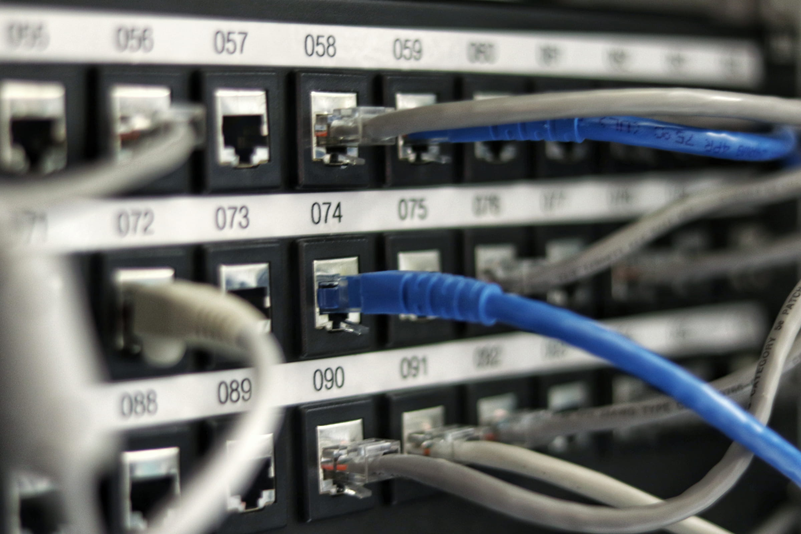

import imageChelseaHagon from '@/images/team/nico.jpeg'

export const article = {
  date: '2026-01-17',
  title: 'Database & Infrastructure',
  description:
    'Integration and management of relational databases such as PostgreSQL and MySQL, along with deployment pipelines and CI/CD workflows.',
  author: {
    name: 'Nicola Gasparro',
    role: 'Infrastructure Engineer',
    image: { src: imageChelseaHagon },
  },
}

export const metadata = {
  title: article.title,
  description: article.description,
}

## 1. Database Design

We design and manage relational databases such as PostgreSQL and MySQL, focusing on performance and scalability. Well-structured data models are essential for long-term product growth.

### Structured data for scalable growth
We design databases that are optimized for performance, clarity and long-term scalability.

### How we work

We carefully structure your data model to ensure everything is organized, efficient and easy to extend over time.

This includes:

defining clear relationships between data, 
avoiding redundancy and inefficiencies, 
planning for future growth from the start.

A well-designed database reduces complexity and improves the overall performance of your application.

### Technical details
- Relational databases (PostgreSQL, MySQL)
- Schema design and normalization
- Indexing strategies for performance optimization
- ORM integration (e.g. Drizzle)
- Migrations and version control for database changes

## 2. Deployment Pipelines

We implement CI/CD workflows to automate testing, building and deployment processes. This ensures faster iterations and more reliable releases.

### Faster releases, fewer errors
We automate the entire deployment process to make releases safe, fast and predictable.

### How we work

We implement continuous integration and deployment pipelines that automatically test and deploy your application.

Every change goes through a controlled process before reaching production.

### Technical details
- CI/CD pipelines (GitHub Actions)
- Build optimization and environment separation (dev / staging / production)
- Docker for consistent environments
- Rollback strategies for safe releases

## 3. Infrastructure Management

We manage infrastructure using modern tools and practices, enabling scalable and stable production environments.

#### Stable, scalable and always available

We manage the infrastructure that runs your application, ensuring high availability and scalability.

### How we work

We set up and maintain environments that can handle real traffic, adapt to growth and remain stable over time.

Our focus is on reliability, performance and simplicity.

### Technical details
- VPS and cloud environments
- Docker-based infrastructure
- Reverse proxy and server configuration (e.g. Nginx)
- Monitoring and logging systems
- Deployment platforms (Vercel / Coolify / custom VPS setups)

### What this means for you
- your application stays online and performant
- infrastructure scales with your business
- you don’t have to worry about technical complexity

## Build on solid foundations

A strong infrastructure is what allows your product to grow without limits.

We help you build systems that are:

- reliable
- scalable
- ready for real-world demands