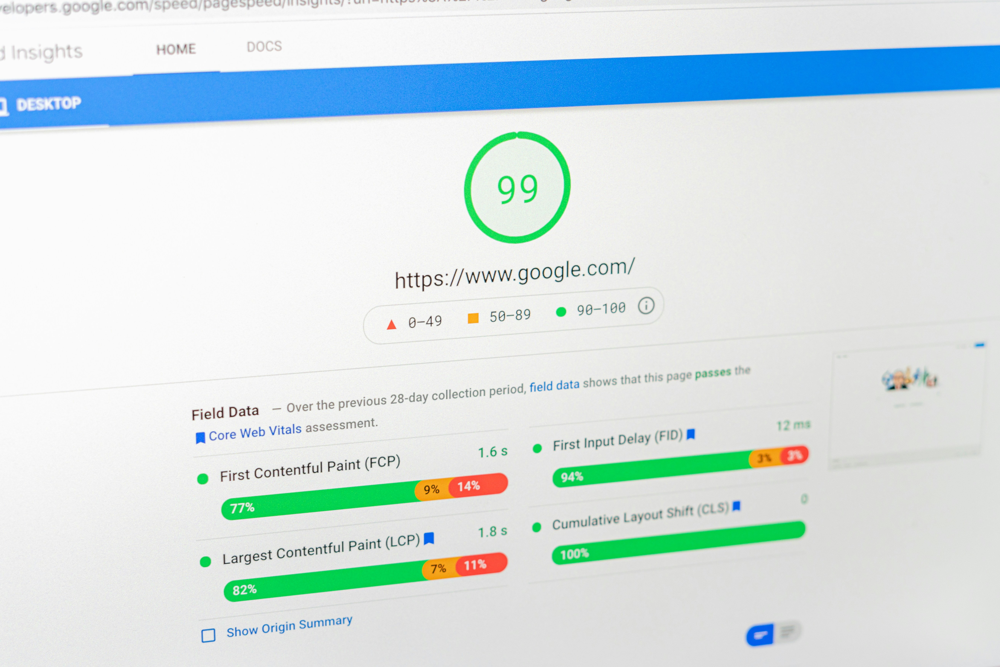

import imageChelseaHagon from '@/images/team/nico.jpeg'

export const article = {
  date: '2026-01-19',
  title: 'Frontend Architecture',
  description:
    'Implementation of scalable frontend architectures for complex applications, ensuring clean codebases and long-term maintainability.',
  author: {
    name: 'Nicola Gasparro',
    role: 'Frontend Architect',
    image: { src: imageChelseaHagon },
  },
  tools: ["Notion", "Figma", "Google lighthouse", "React", "Next.js"]
}

export const metadata = {
  title: article.title,
  description: article.description,
}

## 1. Scalable Frontend Systems

We design frontend architectures that support growth, modularity and team collaboration.

Using modern patterns, we ensure applications remain maintainable as complexity increases.

### How we work

We organize the frontend into clear, modular sections, where each part of the application has a specific role.

This allows:

- multiple developers to work in parallel without conflicts

- faster development of new features

- easier maintenance over time

Instead of a messy codebase, you get a well-structured system that scales smoothly.

## 2. Component Design Patterns

We apply proven React patterns such as compound components, custom hooks and provider-based architectures.

These patterns improve reusability, consistency and developer experience.

### How we work

We design reusable and flexible components using proven patterns.

Each component is:

- easy to reuse across the application

- consistent in behavior and design

- simple to update without breaking other parts
We also structure logic in a way that keeps the UI clean and easy to understand.

## 3. Performance & Optimization

We focus on performance through efficient rendering strategies, data fetching optimization and clean state management.

This ensures fast, responsive user experiences across devices.

### How we work

We optimize how the application loads, renders and handles data.

This includes:

- reducing unnecessary loading times

- ensuring smooth interactions

- optimizing how data is fetched and displayed

Every decision is made to keep the application fast and responsive, even on slower devices.

### What this means for you

- better user experience

- higher engagement and retention

- improved SEO and conversion rates