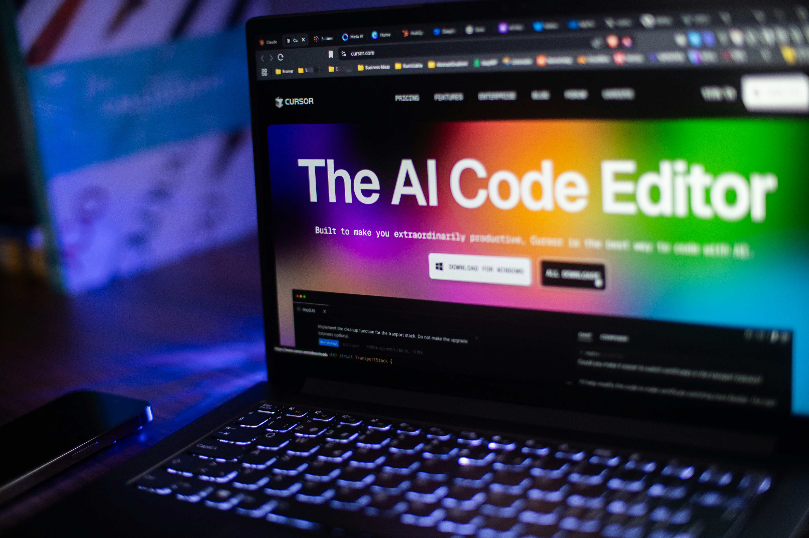

import imageChelseaHagon from '@/images/team/nico.jpeg'

export const article = {
  date: '2026-01-20',
  title: 'Fullstack Development',
  description:
    'Design and development of modern web applications using React, Next.js and Node.js, with a focus on performance, scalability and long-term maintainability.',
  author: {
    name: 'Nicola Gasparro',
    role: 'Web Developer',
    image: { src: imageChelseaHagon },
  },
}

export const metadata = {
  title: article.title,
  description: article.description,
}

## 1. AI Assisted Development

With the launch of Github Copilot in 2022 the industry got its first glimpse at what it would look like to have Stack Overflow plumbed straight into your IDE. Copilot has given thousands of developers what they always longed for: plausible deniability over the bugs they write.

In 2023 we can expect these assistants to become more sophisticated and for that to have ripple effects throughout the industry.

We predict that traffic to MDN will decline precipitously as developers realise they no longer need to look up JS array methods. We also expect Stack Overflow’s sister site, Prompt Overflow, to become one of the most popular sites on the internet in a matter of months.

### How we build it

We integrate AI tools directly into the development workflow to speed up coding, reduce boilerplate and improve code quality.
AI is used as a pair programmer, supporting everything from prototyping to debugging and documentation.

### Tools & Technologies

- GitHub Copilot / ChatGPT for code generation and debugging

- Cursor / AI-powered IDEs

- ESLint + Prettier for code consistency

- Vitest / Jest for AI-assisted test generation

- Notion / Markdown for AI-generated documentation

## 2. Modern Web Applications

We design and develop fullstack applications using modern technologies such as React and Next.js, focusing on performance, scalability and clean architecture.

Our goal is to build applications that are not only functional, but also maintainable and ready to evolve over time.

### How we build it

We follow a component-driven approach combined with server-side rendering and API-first design.
Applications are structured to separate concerns clearly between UI, business logic and data layers.

### Tools & Technologies

- React + Next.js (App Router)

- TypeScript for type safety

- Node.js / API Routes / Server Actions

- Drizzle / Serverless PostgreSQL or MongoDB

- Pico.css (lightweight styling, performance-first)

- Vite / Turbopack for fast builds

## 3. Scalable Architecture

We structure applications using feature-based architecture and modular design patterns, allowing teams to scale efficiently as products grow.

This approach reduces technical debt and improves long-term sustainability.

### How we build it

We adopt a feature-based architecture where each domain is isolated and reusable.
Codebases are designed to support team growth, parallel development and easy refactoring.

### Tools & Technologies

- Feature-based folder structure
- Clean Architecture
- Zod for schema validation
- tRPC or REST APIs

## 3. Production-Ready Development

We build applications that are ready for real-world usage, including authentication, API integrations and deployment workflows.

Our experience spans multiple industries including sustainability platforms and fintech applications.

### How we build it

We implement end-to-end production workflows, covering security, CI/CD, monitoring and deployment.
Each project is delivered with a robust infrastructure and best practices from day one.

### Tools & Technologies

- Authentication: NextAuth / Auth.js / Clerk, Stack Auth, Better Auth

- CI/CD: GitHub Actions

- Deployment: Vercel / Docker / VPS (Coolify)

- API integrations: third-party services

- Environment management: dotenv